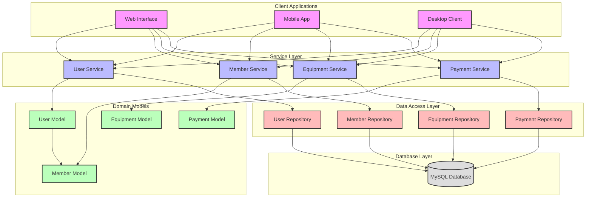

# GDMS Visual Architecture

## System Components

### Client Applications
- **Web Interface**: Browser-based access
- **Mobile App**: Native mobile application
- **Desktop Client**: Standalone desktop application

### Service Layer
- **User Service**: User management
- **Member Service**: Member operations
- **Equipment Service**: Equipment management
- **Payment Service**: Payment processing

### Domain Models
- **User**: Base user model
- **Member**: Gym member model
- **Equipment**: Equipment tracking
- **Payment**: Payment handling

### Data Access Layer
- **User Repository**: User data access
- **Member Repository**: Member data access
- **Equipment Repository**: Equipment data access
- **Payment Repository**: Payment data access

### Database Layer
- **MySQL Database**: Data storage

## Key Features
- Multi-client support
- Secure authentication
- Member management
- Equipment tracking
- Payment processing
- Data persistence 